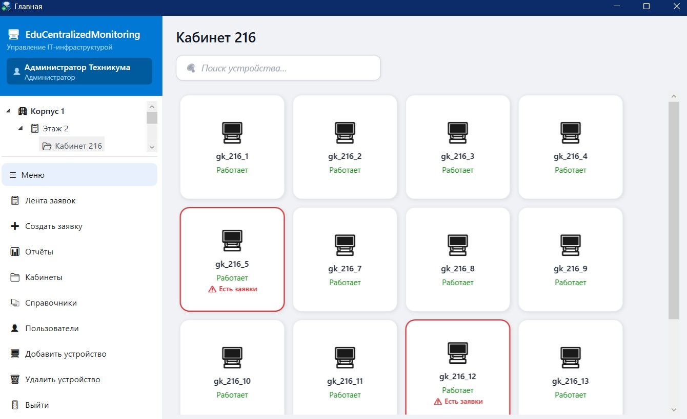
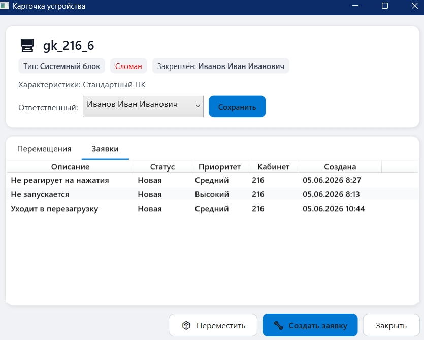
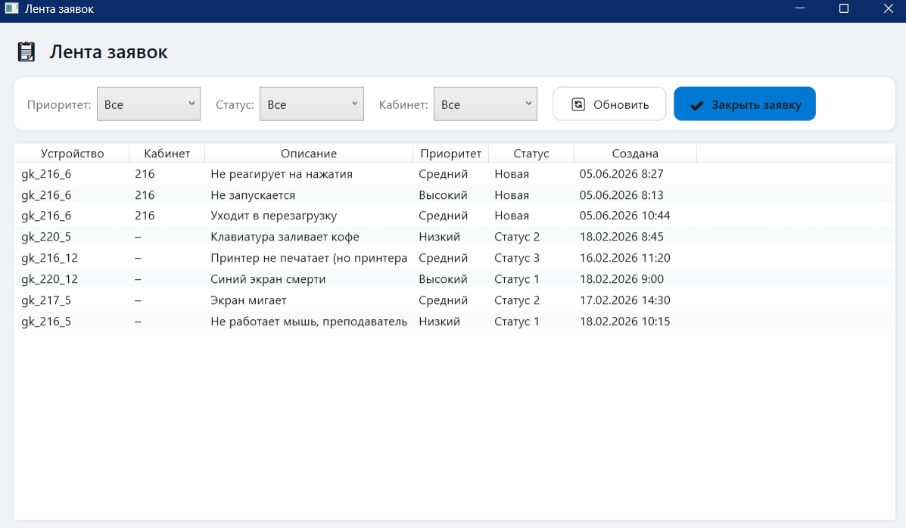
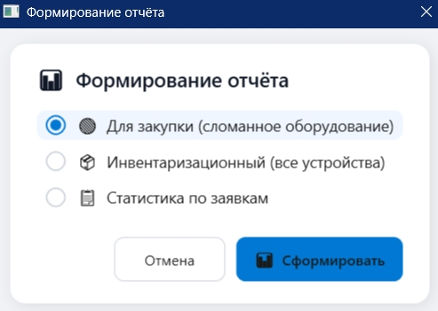
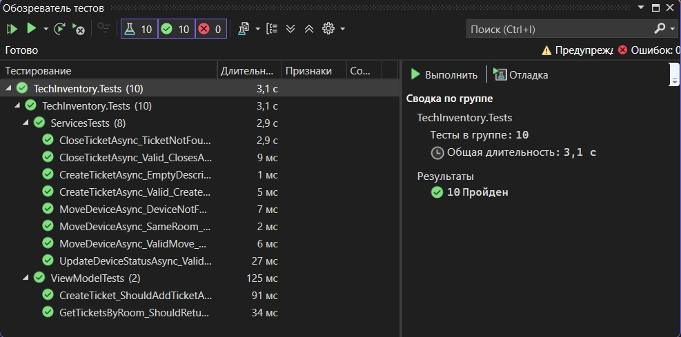

# Система управления IT-инфраструктурой техникума

**Десктопное приложение для учёта оборудования и диспетчеризации заявок на ремонт**


## О проекте

Это современное **WPF-приложение** с плиточным интерфейсом (в стиле Windows 11), предназначенное для автоматизации работы IT-службы образовательного учреждения. Приложение позволяет вести учёт техники по кабинетам, отслеживать перемещения оборудования и оперативно обрабатывать заявки на ремонт.

## Основные возможности

- **Иерархическое дерево** — Корпус → Этаж → Кабинет
- **Плиточное отображение** устройств в выбранном кабинете
- **Визуальная индикация** проблемных устройств (подсветка + значок "!")
- **Детальная карточка устройства** с историей перемещений и заявок
- **Учёт перемещений** оборудования с сохранением полной истории
- **Лента заявок** с удобными фильтрами (приоритет, статус, кабинет)
- **Создание и закрытие заявок** администратором
- **Автоматические отчёты** через Python (закупка, инвентаризация, статистика)
- **Ролевая модель** (Admin / Teacher)

## Скриншоты



*Главное окно с деревом и плитками устройств*



*Детальная карточка устройства*



*Лента заявок с фильтрами*



*Формирование отчётов*

## Технологический стек

- **Язык и фреймворк**: C# + WPF (.NET 8)
- **Архитектура**: MVVM
- **База данных**: SQLite
- **Доступ к данным**: ADO.NET + SQLite
- **Отчёты**: Python (pandas, openpyxl)
- **Дизайн**: Современный Material-стиль

## Установка и запуск

1. Клонируй репозиторий
2. Убедись, что установлен **.NET 8 SDK**
3. Установи **Python 3.10+** и библиотеки:
   ```bash
   pip install
   pandas openpyxl
4. Запусти проект через Visual Studio 2022+

## Требования

- Windows 10 / 11
- .NET 8 Runtime
- Python 3.10+

## Юнит-тесты

Проект `TechInventory.Tests` содержит **10 юнит-тестов** на [xUnit](https://xunit.net/) + [Moq](https://github.com/moq/moq4).

### Запуск

```bash
dotnet test
```

### Покрытие

| # | Тест | Компонент | Сценарий |
|---|---|---|---|
| 1 | `MoveDeviceAsync_ValidMove` | `DeviceService` | Успешное перемещение — создаётся запись в `MovementHistory`, обновляется `CurrentRoomID` |
| 2 | `MoveDeviceAsync_SameRoom` | `DeviceService` | Перемещение в тот же кабинет → `BusinessException` |
| 3 | `MoveDeviceAsync_DeviceNotFound` | `DeviceService` | Устройство не найдено → `BusinessException` |
| 4 | `UpdateDeviceStatusAsync_ValidDevice` | `DeviceService` | Статус устройства меняется корректно |
| 5 | `CreateTicketAsync_Valid` | `TicketService` | Заявка создаётся, устройство получает статус «Сломан» |
| 6 | `CreateTicketAsync_EmptyDescription` | `TicketService` | Пустое описание → `BusinessException` |
| 7 | `CloseTicketAsync_Valid` | `TicketService` | Заявка закрывается, `ClosedAt` устанавливается, резолюция добавляется |
| 8 | `CloseTicketAsync_TicketNotFound` | `TicketService` | Заявка не найдена → `BusinessException` |
| 9 | `CreateTicket_ShouldAddTicketAndUpdateDeviceStatus` | Интеграционный | Создание заявки через реальную БД меняет статус устройства на «Сломан» |
| 10 | `GetTicketsByRoom_ShouldReturnTicketsForGivenRoom` | Интеграционный | Фильтрация заявок по кабинету возвращает только нужные записи |

### Результаты



## Структура проекта

```bash
Edu-Centralized-Monitoring/                  ← Корень репозитория
│
├── Inventory.Core/                          # Серверная часть — бизнес-логика
│   ├── Common/
│   │   └── Exceptions/
│   │       └── BusinessException.cs
│   ├── Constants/
│   │   └── TicketStatuses.cs
│   ├── Interfaces/
│   │   ├── IDeviceRepository.cs
│   │   ├── IDeviceService.cs
│   │   ├── IDictionaryRepository.cs
│   │   ├── IMovementRepository.cs
│   │   ├── IRoomRepository.cs
│   │   ├── ITicketRepository.cs
│   │   ├── ITicketService.cs
│   │   └── IUserRepository.cs
│   ├── Models/
│   │   ├── Device.cs
│   │   ├── DictionaryItem.cs
│   │   ├── MovementHistory.cs
│   │   ├── Room.cs
│   │   ├── Ticket.cs
│   │   └── User.cs
│   ├── Repositories/
│   │   ├── BaseRepository.cs
│   │   ├── DeviceRepository.cs
│   │   ├── DictionaryRepository.cs
│   │   ├── MovementRepository.cs
│   │   ├── RoomRepository.cs
│   │   ├── TicketRepository.cs
│   │   └── UserRepository.cs
│   ├── Services/
│   │   ├── DeviceService.cs
│   │   └── TicketService.cs
│   ├── AppServices.cs
│   └── DatabaseMigrator.cs
│
├── TechInventory/                           # Клиентская часть — WPF-приложение
│   ├── Helpers/
│   │   ├── BoolToVisibilityConverter.cs
│   │   ├── Logger.cs
│   │   ├── PasswordHasher.cs
│   │   ├── RelayCommand.cs
│   │   ├── StatusToColorConverter.cs
│   │   └── StringToVisibilityConverter.cs
│   ├── Scripts/
│   │   └── report_generator.py
│   ├── ViewModels/
│   │   ├── BuildingNodeViewModel.cs
│   │   ├── DeviceCardViewModel.cs
│   │   ├── DeviceTileViewModel.cs
│   │   ├── FloorNodeViewModel.cs
│   │   ├── LoginViewModel.cs
│   │   ├── MainViewModel.cs
│   │   ├── RoomNodeViewModel.cs
│   │   ├── TicketListItem.cs
│   │   ├── TicketListViewModel.cs
│   │   ├── TreeNodeViewModel.cs
│   │   └── ViewModelBase.cs
│   ├── Views/
│   │   ├── CreateTicketWindow.xaml(.cs)
│   │   ├── DeviceCardWindow.xaml(.cs)
│   │   ├── DeviceEditWindow.xaml(.cs)
│   │   ├── DictionaryWindow.xaml(.cs)
│   │   ├── LoginWindow.xaml(.cs)
│   │   ├── MainWindow.xaml(.cs)
│   │   ├── MoveDeviceWindow.xaml(.cs)
│   │   ├── RegisterWindow.xaml(.cs)
│   │   ├── ReportWindow.xaml(.cs)
│   │   ├── RoomEditWindow.xaml(.cs)
│   │   ├── RoomsManagementWindow.xaml(.cs)
│   │   ├── SelectDeviceWindow.xaml(.cs)
│   │   ├── TicketsWindow.xaml(.cs)
│   │   ├── UserEditWindow.xaml(.cs)
│   │   └── UsersWindow.xaml(.cs)
│   └── App.xaml(.cs)
│
├── TechInventory.Tests/                     # Юнит-тесты (xUnit + Moq)
│   ├── ServicesTests.cs                     # 8 тестов через моки (DeviceService, TicketService)
│   ├── ViewModelTests.cs                    # 2 интеграционных теста на реальной БД
│   └── TestDatabase.cs                      # Вспомогательная in-memory БД для тестов
│
├── screenshots/                             # Скриншоты для README
├── .gitignore
├── edu-centralized-monitoring.ico           # Иконка приложения
├── README.md
└── TechInventory.sln                        # Solution Visual Studio
